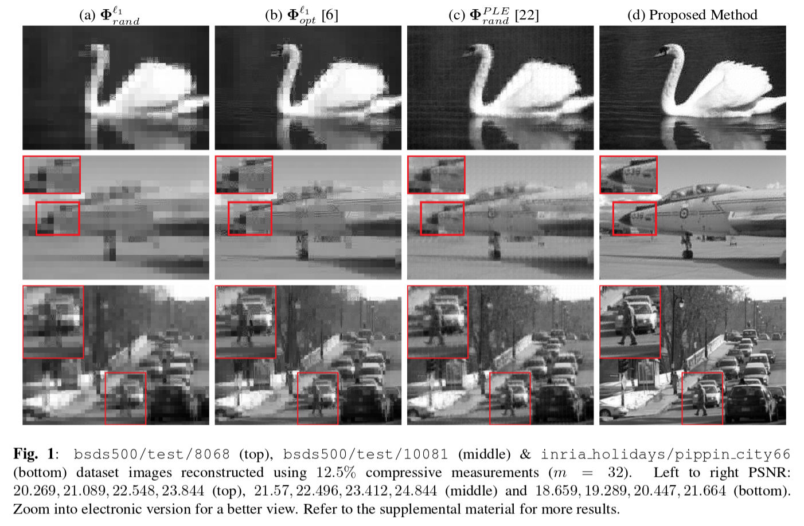

# Designing Constrained Projections for Compressed Sensing: Mean Errors and Anomalies with Coherence
#### Dhruv Shah (dhruv.ilesh@gmail.com), Alankar Kotwal and Ajit Rajwade

##### [[Project Page](https://prieuredesion.github.io/constrained-projections/)] [[Supplemental Material](https://prieuredesion.github.io/docs/globalsip2018-supplementary.pdf)]

--------------------------------------------------------------------------------------------

This repository contains the authors' implementation for the paper "_Designing Constrained Projections for Compressed Sensing: Mean Errors and Anomalies with Coherence_" submitted to IEEE Global Conference on Signal and Information Processing 2018.

 * `coherence-opt/`: Our implementation of average coherence-based projection design, described in section 3 of the paper.
 * `datasets/`: Test natural images drawn from the [Berkeley Segmentation Data Set (BSDS500)](https://www2.eecs.berkeley.edu/Research/Projects/CS/vision/grouping/resources.html#bsds500) and the [INRIA Holidays Data Set](http://lear.inrialpes.fr/~jegou/data.php#holidays) for testing the algorithms and generating results. _These images were not a part of the training data._
 * `designed-matrices/`: Sample matrices designed using the various algorithms discussed in the paper provided for use.
 * `gmm-train/`: Unoptimized implementation sourced from [MATLAB File Exchange](https://uk.mathworks.com/matlabcentral/fileexchange/26184-em-algorithm-for-gaussian-mixture-model--em-gmm-), courtesy Mo Chen (downloaded 2018-01-19). A sample GMM trained on natural image patches from BSDS500 can be found as `gmm-train/results/trained-model.mat`.
 * `misc/`: Miscellaneous files useful for reconstruction and file handling. This includes original implementations of [l1-magic](https://statweb.stanford.edu/~candes/l1magic/), [SPGL1](http://www.cs.ubc.ca/~mpf/spgl1/download.html), our implementation of the piecewise-linear decoder and other scripts.
 * `mmse-opt/`: Our implementation of the MMSE-based projection design algorithm proposed in section 4.3 of the paper.
 * `results/`: Compare different reconstruction methods (and matrices) and visualize results. Results from the paper can be replicated using the scripts provided.